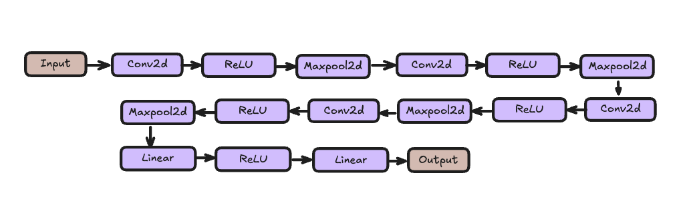
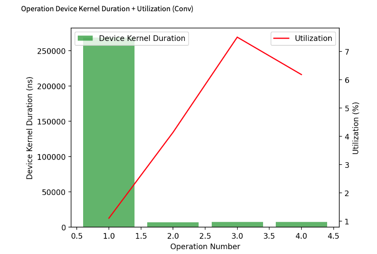
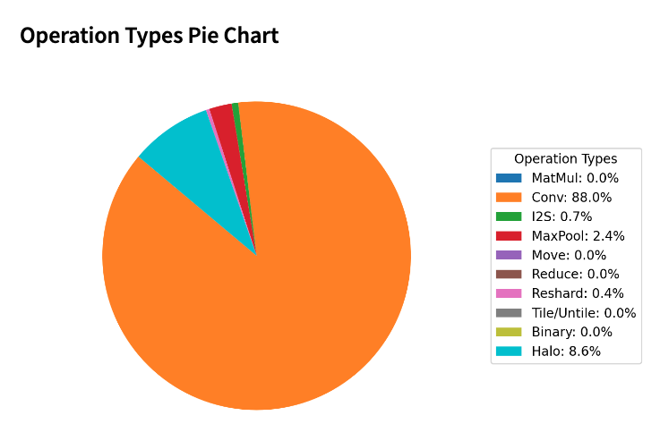
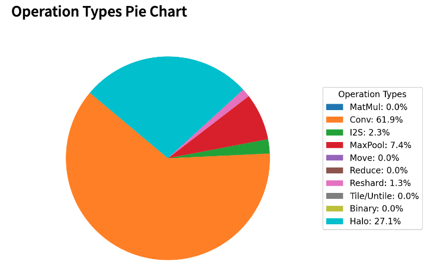
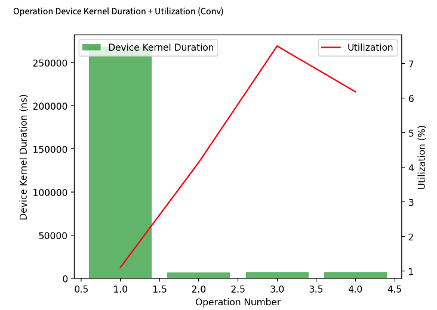
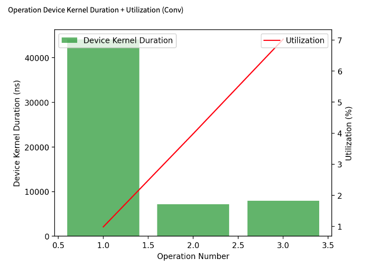
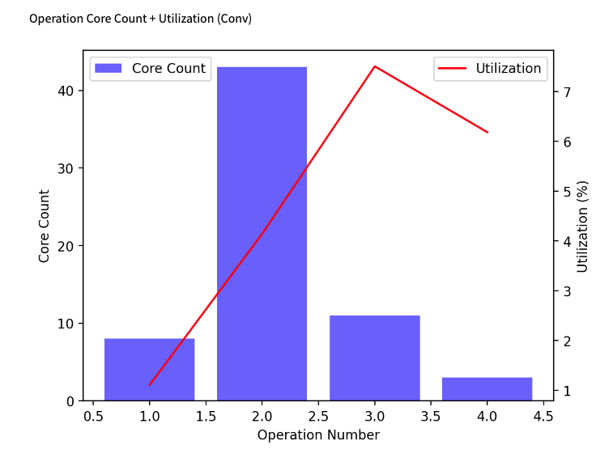
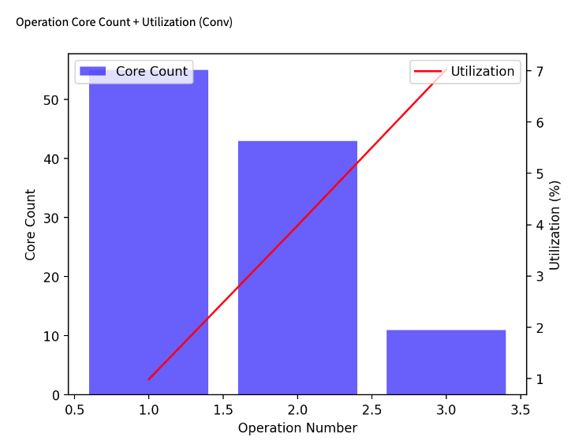

# MNIST-like model in TT-NN

## Contents

- [MNIST-LIKE in TT-NN](#mnist-like-model-in-tt-nn)
  - [Contents](#contents)
  - [1. Overview](#1-overview)
  - [2. MNIST-LIKE TT-NN Code Structure](#2-mnist-like-model-tt-nn-code-structure)
    - [2.1 Convolution operation](#21-convolution-operation)
  - [3. MNIST-LIKE TT-NN Optimization Techniques](#3optimisation-techniques)
    - [3.1 Sharding on all relevant OPs](#31-sharding-on-all-relevant-ops)
    - [3.2 Sharding techniques for convolution](#32-sharding-techniques-for-convolution)
    - [3.3 Data type Optimization](#33-data-type-optimization)
    - [3.4 Other common Optimization](#34-other-common-optimization)
  - [4. Conclusion](#5-conclusion)


## 1. Overview
The MNIST-like model is a Convolutional Neural Network (CNN) designed for image classification. It takes an image input, passes it through several convolutional layers with pooling, then flattens the output and passes it through fully connected layers designed to classify images of handwritten digits (0-9). </br>The model expects input images with 5 channels and includes several convolutional layers: Conv1 applies 32 filters of size 5x5 followed by 3x3 max pooling, while Conv2, Conv3, and Conv4 each use 64 filters of size 3x3, followed by 2x2 max pooling to capture increasingly complex features. The output of these layers is flattened and passed through two fully connected layers: FC1 with 1024 units, and FC2, which produces the final classification output with 10 units, representing the 10 digit classes.

## 2. MNIST-like model TT-NN Code Structure



<b> Input Layer:</b>The model expects images with 5 channels (unusual for MNIST, which typically has 1 channel). These could be multi-channel images or feature-augmented data.</br>
<b>Convolutional Layers:</b>
Conv1: 32 filters of size 5x5, followed by MaxPooling with a 3x3 kernel. This extracts low-level features from the image.
Conv2, Conv3, Conv4: 64 filters of size 3x3, each followed by MaxPooling with a 2x2 kernel. These layers capture more complex features as the network deepens.</br>
<b>Fully Connected Layers:</b>
FC1: A dense layer with 1024 units that takes the flattened features from the convolutional layers.
FC2: The output layer with 10 units, corresponding to the 10 digit classes (0-9).</br>
The final output is a vector of size 10, representing the predicted probabilities for each of the 10 digits (0-9).</br>
<b>Forward Pass:</b>
The input is passed through the convolutional layers with ReLU activations and pooling.
The output is flattened and passed through the fully connected layers.
The final output layer predicts the class probabilities for the digits 0-9.</br></br>
The pytorch implementation would look like,
```python
class Mnist_like_model(nn.Module):
    def __init__(self, num_classes):
        super(Mnist_like_model, self).__init__()
        self.conv1 = nn.Conv2d(in_channels=5, out_channels=32, kernel_size=5, padding=2)
        self.pool2 = nn.MaxPool2d(2, 2)
        self.pool4 = nn.MaxPool2d(2, 2)
        self.pool5 = nn.MaxPool2d(2, 2)
        self.pool3 = nn.MaxPool2d(3, 3)
        self.conv2 = nn.Conv2d(in_channels=32, out_channels=64, kernel_size=3, padding=1)
        self.conv3 = nn.Conv2d(in_channels=64, out_channels=64, kernel_size=3, padding=1)
        self.conv4 = nn.Conv2d(in_channels=64, out_channels=64, kernel_size=3, padding=1)
        self.fc1 = nn.Linear(3 * 3 * 64, 1024)  # 100 x 100 region
        self.fc2 = nn.Linear(1024, num_classes)

    def forward(self, x):
        x = self.pool3(F.relu(self.conv1(x)))
        x = self.pool2(F.relu(self.conv2(x)))
        x = self.pool4(F.relu(self.conv3(x)))
        x = self.pool5(F.relu(self.conv4(x)))
        x = x.view(-1, 3 * 3 * 64)
        x = F.relu(self.fc1(x))
        x = self.fc2(x)
        return x

```
TTNN implementation would be like,
```python
class Mnist_like_model:
    def __init__(self, device, parameters: ParameterDict):
        self.device = device
        self.parameters = parameters
        self.conv1 = Mnist_like_model_Conv2D(parameters.conv1, device=device, num_cores_nhw = 56)
        self.conv2 = Mnist_like_model_Conv2D(parameters.conv2, device=device, num_cores_nhw = 48)
        self.conv3 = Mnist_like_model_Conv2D(parameters.conv3, device=device, num_cores_nhw = 16)
        self.conv4 = Mnist_like_model_Conv2D(parameters.conv4, device=device)
        self.fc1_weights = parameters.fc1.module.weight
        self.fc2_weights = parameters.fc2.module.weight
        self.fc1_bias = parameters.fc1.module.bias
        self.fc2_bias = parameters.fc2.module.bias

        self.pool3 = nn.MaxPool2d(3, 3)
        self.fc1 = nn.Linear(3 * 3 * 64, 1024)  # 100 x 100 region
        self.fc1.weight = parameters.fc1.module.weight
        self.fc1.bias = parameters.fc1.module.bias
        self.fc2 = nn.Linear(1024, 11)
        self.fc2.weight = parameters.fc2.module.weight
        self.fc2.bias = parameters.fc2.module.bias

    def __call__(self, x):
        x = self.conv1(x)
        x = ttnn_to_torch_processing(
            x,
            self.parameters.pool3.batch_size,
            self.parameters.conv1.out_channels,
            self.parameters.pool3.input_height,
            self.parameters.pool3.input_width,
        )
        x = self.pool3(x)
        x = torch_to_ttnn_processing(x, self.device)
        x = self.conv2(x)
        x = ttnn.max_pool2d(
            input_tensor=x,
            batch_size=self.parameters.pool2.batch_size,
            input_h=self.parameters.pool2.input_height,
            input_w=self.parameters.pool2.input_width,
            channels=self.parameters.conv2.out_channels,
            kernel_size=[self.parameters.pool2.kernel_size, self.parameters.pool2.kernel_size],
            stride=[self.parameters.pool2.stride, self.parameters.pool2.stride],
            padding=[self.parameters.pool2.padding, self.parameters.pool2.padding],
            dilation=[self.parameters.pool2.dilation, self.parameters.pool2.dilation],
        )
        x = self.conv3(x)
        x = ttnn.max_pool2d(
            input_tensor=x,
            batch_size=self.parameters.pool4.batch_size,
            input_h=self.parameters.pool4.input_height,
            input_w=self.parameters.pool4.input_width,
            channels=self.parameters.conv3.out_channels,
            kernel_size=[self.parameters.pool4.kernel_size, self.parameters.pool4.kernel_size],
            stride=[self.parameters.pool4.stride, self.parameters.pool4.stride],
            padding=[self.parameters.pool4.padding, self.parameters.pool4.padding],
            dilation=[self.parameters.pool4.dilation, self.parameters.pool4.dilation],
        )
        x = self.conv4(x)
        x = ttnn.max_pool2d(
            input_tensor=x,
            batch_size=self.parameters.pool5.batch_size,
            input_h=self.parameters.pool5.input_height,
            input_w=self.parameters.pool5.input_width,
            channels=self.parameters.conv4.out_channels,
            kernel_size=[self.parameters.pool5.kernel_size, self.parameters.pool5.kernel_size],
            stride=[self.parameters.pool5.stride, self.parameters.pool5.stride],
            padding=[self.parameters.pool5.padding, self.parameters.pool5.padding],
            dilation=[self.parameters.pool5.dilation, self.parameters.pool5.dilation],
        )

        pool5_ouput_height = int(
            (
                (
                    self.parameters.pool5.input_height
                    + ((-(self.parameters.pool5.dilation) * (self.parameters.pool5.kernel_size - 1)) - 1)
                )
                / self.parameters.pool5.stride
            )
            + 1
        )
        pool5_ouput_width = int(
            (
                (
                    self.parameters.pool5.input_width
                    + ((-(self.parameters.pool5.dilation) * (self.parameters.pool5.kernel_size - 1)) - 1)
                )
                / self.parameters.pool5.stride
            )
            + 1
        )

        x = ttnn_to_torch_processing(
            x,
            self.parameters.pool5.batch_size,
            self.parameters.conv4.out_channels,
            pool5_ouput_height,
            pool5_ouput_width,
        )

        x = x.reshape(x.shape[0], -1)

        x = x.to(torch.float32)
        x = self.fc1(x)

        x = ttnn.from_torch(x, dtype=ttnn.bfloat16, device=self.device, layout=ttnn.TILE_LAYOUT)

        x = ttnn.relu(x)

        x = ttnn.to_torch(x).to(torch.float32)

        x = self.fc2(x)

        return x
```
### 2.1 Convolution operation
A common function called `Mnist_like_model_Conv2D` has been created to handle the preprocessing and configure the necessary settings for the convolution operation, based on the attributes and dimensions of each convolution,
```python
class Mnist_like_model_Conv2D:
    def __init__(
        self,
        conv,
        bn=None,
        device=None,
        cache={},
        activation="relu",
        activation_dtype=ttnn.bfloat16,
        weights_dtype=ttnn.bfloat8_b,
        use_1d_systolic_array=True,
        shard_layout=ttnn.TensorMemoryLayout.HEIGHT_SHARDED,
        num_cores_nhw = None,
    ):
        self.device = device
        self.batch_size = conv.batch_size
        self.input_height = conv.input_height
        self.input_width = conv.input_width
        self.in_channels = conv.in_channels
        self.out_channels = conv.out_channels
        self.kernel_size = conv.kernel_size
        self.padding = conv.padding
        self.stride = conv.stride
        self.groups = conv.groups
        self.use_1d_systolic_array = use_1d_systolic_array
        self.deallocate_activation = True
        self.cache = cache

        self.conv_config = ttnn.Conv2dConfig(
            dtype=activation_dtype,
            weights_dtype=weights_dtype,
            math_fidelity=ttnn.MathFidelity.LoFi,
            shard_layout=shard_layout,
            deallocate_activation=self.deallocate_activation,
            reshard_if_not_optimal=True if self.use_1d_systolic_array else False,
            activation=activation,
        )
        if(num_cores_nhw is not None):
            shard_grid = get_shard_grid_from_num_cores(num_cores_nhw, device)

            self.conv_config.core_grid = shard_grid
            self.conv_config.override_sharding_config = True

        config_override = conv.conv_blocking_and_parallelization_config_override
        if config_override and "act_block_h" in config_override:
            self.conv_config.act_block_h_override = config_override["act_block_h"]
        if bn is not None:
            weight, bias = fold_batch_norm2d_into_conv2d(conv.module, bn.module)
        else:
            weight, bias = conv.module.weight, conv.module.bias
        weight = weight
        if bias is not None:
            bias = torch.reshape(bias, (1, 1, 1, -1))
            self.bias = ttnn.from_torch(bias, dtype=ttnn.float32)
        else:
            self.bias = None
        self.weight = ttnn.from_torch(weight, dtype=ttnn.float32)

    def __call__(self, x):
        x, output_height, output_width, self.weight, self.bias = ttnn.conv2d(
            input_tensor=x,
            weight_tensor=self.weight,
            bias_tensor=self.bias,
            device=self.device,
            in_channels=self.in_channels,
            out_channels=self.out_channels,
            input_height=self.input_height,
            input_width=self.input_width,
            batch_size=self.batch_size,
            kernel_size=self.kernel_size,
            stride=self.stride,
            padding=self.padding,
            conv_config=self.conv_config,
            conv_op_cache=self.cache,
            groups=self.groups,
        )
        return x
```

## 3.Optimisation techniques
### 3.1 Sharding on all relevant OPs
- Applying sharding techniques to harvest the optimum utilization of the computation OPs, by eliminating the need for data movement inter-tensix-cores between the consecutive OPs.
  - For more details, please refer to the [related tech-report](https://github.com/tenstorrent/tt-metal/blob/main/tech_reports/tensor_layouts/tensor_layouts.md#42-sharding)
  - Sharding Concepts

  - Illustrative example


#### Example:

#### Functional Code:
```py
        output_tensor = ttnn.sharded_to_interleaved(output_tensor, ttnn.L1_MEMORY_CONFIG)
        output_tensor_left = ttnn.sharded_to_interleaved(output_tensor_left, ttnn.L1_MEMORY_CONFIG)
        output_tensor = ttnn.concat([output_tensor, output_tensor_left], dim=3, memory_config=ttnn.L1_MEMORY_CONFIG)
```
#### Optimized Code:
```py
        output_tensor = ttnn.to_layout(output_tensor, layout=ttnn.ROW_MAJOR_LAYOUT)
        output_tensor_left = ttnn.to_layout(output_tensor_left, layout=ttnn.ROW_MAJOR_LAYOUT)
        output_sharded_memory_config = ttnn.create_sharded_memory_config(
            [512, 128],
            core_grid=output_tensor_left.memory_config().shard_spec.grid,
            strategy=ttnn.ShardStrategy.HEIGHT,
            use_height_and_width_as_shard_shape=True,
        )
        output_tensor = ttnn.concat(
            [output_tensor, output_tensor_left], dim=3, memory_config=output_sharded_memory_config
        )
```
### 3.2 Sharding techniques for convolution

Utilizing the appropriate sharding layout for convolution can enhance the core count of convolution and matrix multiplication operations, leading to improved overall performance. The recommended sharding strategies for convolution are as follows: use BLOCK_SHARDED when
𝐶
≈
𝑁
×
𝐻
×
𝑊
C≈N×H×W, HEIGHT_SHARDED when
𝑁
×
𝐻
×
𝑊
≫
𝐶
N×H×W≫C, and WIDTH_SHARDED when
𝐶
≫
𝑁
×
𝐻
×
𝑊
C≫N×H×W.

Consider 512x512 tensor, where each 512x512 input tensor will be divided into smaller 16x16 tiles across 4 cores. Lets see how different types of sharding looks,

#### Height sharding
```py
    conv_config = ttnn.Conv2dConfig(
            shard_layout=ttnn.TensorMemoryLayout.HEIGHT_SHARDED,
            )
```


#### Width sharding
```py
    conv_config = ttnn.Conv2dConfig(
            shard_layout=ttnn.TensorMemoryLayout.WIDTH_SHARDED,
            )
```


#### Block sharding
```py
    conv_config = ttnn.Conv2dConfig(
            shard_layout=ttnn.TensorMemoryLayout.BLOCK_SHARDED,

```


For instance, consider two input configurations: The First input is sized [1, 3, 224, 224], also with a kernel size of (3, 3), padding of (1, 1), and a stride of (2, 2). the second input has a size of [1, 736, 28, 28] (in NHWC format) with a kernel size of (1, 1), padding of (0, 0), and a stride of (1, 1).

According to the guidelines, the optimal sharding is to apply HEIGHT_SHARDED for the first input (since
𝑁
×
𝐻
×
𝑊
≫
𝐶
N×H×W≫C) and BLOCK_SHARDED for the second input (as
𝑁
×
𝐻
×
𝑊
≈
𝐶
N×H×W≈C).

### 3.3 Data type Optimization
- Uses more efficient data types (e.g., `bfloat8_b`) to reduce memory usage and enhance computation speed.

- Similar to the functional implementation but uses more efficient data types and operations.


Functional Code:-

```python
conv_config = ttnn.Conv2dConfig(
        weights_dtype=ttnn.bfloat16,
)
```

Optimized Code:-

```python
conv_config = ttnn.Conv2dConfig(
        weights_dtype=ttnn.bfloat8_b,
)
```
When you convert the datatype from bfloat16 to bfloat8 in MNIST-LIKE, you see an increase in FPS as follows due to the reduced computational load,

<table>
  <thead style="background-color: #f2f2f2;">
    <tr>
      <th>Precision</th>
      <th>FPS (MatMul/Conv Ops only)</th>
      <th>FPS (Other Device Ops)</th>
      <th>FPS (All Ops)</th>
    </tr>
  </thead>
  <tbody>
    <tr style="background-color: #fafafa;">
      <td><b>bfloat8</b></td>
      <td>3447.289</td>
      <td>18673.09</td>
      <td>2910.056</td>
    </tr>
    <tr style="background-color: #fafafa;">
      <td><b>bfloat16</b></td>
      <td>3271.695</td>
      <td>18677.275</td>
      <td>2784.019</td>
    </tr>
  </tbody>
</table>


### 3.4 Other common Optimization
Here are the convolution parameters that can be utilized to enhance the performance of convolution:

1. Set math_fidelity to `MathFidelity::LoFi`
```py
conv_config = ttnn.Conv2dConfig(
        math_fidelity=ttnn.MathFidelity.LoFi,
    )
```

2. Enable `deallocate_activation` if you are not using the input tensor of the conv anywhere after passing into this conv.
```py
conv_config = ttnn.Conv2dConfig(
        deallocate_activation=True,
        )
```
3. Increasing the `core_count` decreases the kernel duration, as the additional cores allow for more parallel processing, improving the throughput of operations like matrix multiplications (MatMul) and convolutions (Conv), as well as other device operations.
```py
shard_grid = get_shard_grid_from_num_cores(num_cores_nhw, device)
self.conv_config.core_grid = shard_grid
```
In the diagrams below, we can see the the decrease in the kernel duration in the convs, when we increase the core count
<div style="display: flex; justify-content: space-between;">
  
  
</div>

Also there is a variation in the operation usage, as shown below
<div style="display: flex; justify-content: space-between;">
  
  
</div>

4. Enable `reshard_if_not_optimal`, if `shard_layout = TensorMemoryLayout::HEIGHT_SHARDED` and `override_sharding_config` is false which allows Conv to pick the optimal sharding config based on “height_sharding” config and reshards activation tensor to it.
```py
conv_config = ttnn.Conv2dConfig(
        reshard_if_not_optimal=True,
        )
```

5. Enable `override_sharding_config` if `shard_layout = TensorMemoryLayout::HEIGHT_SHARDED` and `reshard_if_not_optimal` is `false` and if `true`, core_grid must be provided. If enabled Conv op reshards activation tensor to it
```py
                conv_config = ttnn.Conv2dConfig(
                        override_sharding_config=True,
                        )
```
In the MNIST-like model, enabling override_sharding_config along with providing a core_grid results in an increase in FPS and overall utilization.</br>
Below graphs show the increase in the core utilisation and decrease in the kernel duration of conv,
<div style="display: flex; justify-content: space-between;">
  
  
</div>

Attaching graphs illustrating the relationship between core count and the utilisation of those core while performing conv opertaion,
<div style="display: flex; justify-content: space-between;">
  
  
</div>

## 4. Conclusion
This guide outlines the MNIST-like model, its submodules and optimization techniques implemented in the MNIST-like model.
